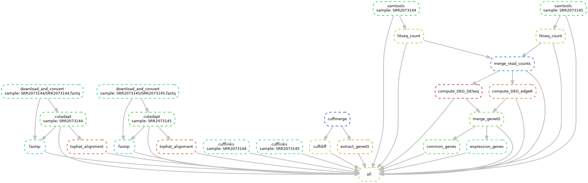
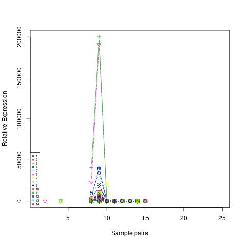
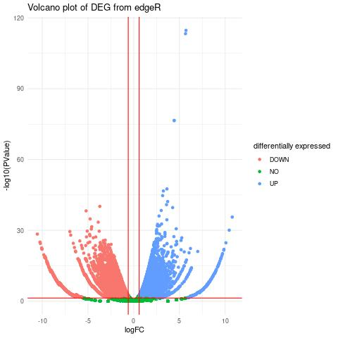

# Dataprocessing-RNA-Seq

RNA-Seq is a snakemake pipeline for data analysis and data processing. 
RNA-Seq makes it possible to map the overall gene expression and thus the transcriptional activity of cells.  
This project focuses thus on differential analysis of gene expression of Arabidopsis transcriptome.  

RNA-Seq is a recreation of the project from [deshpan4 RNA-Seq-pipeline](https://github.com/deshpan4/RNA-Seq-pipeline).

## Repository structure
Below is the repository structure after the workflow is executed.
```
├── alignment
│   ├── SRR2073144-aligned-tophat/
│   ├── SRR2073144-samtools/
│   ├── SRR2073145-aligned-tophat/
|   └── SRR2073145-samtools/
├── benchmarks/
├── commonGenes/
├── config
|   └── config.yaml
├── cuffdiff
|   └── diff_out_quartile/
├── cufflinks
│   ├── SRR2073144-cufflinks/
│   └── SRR2073145-cufflinks/
├── cutadapt/
├── DEG/
├── extract/
├── fastq_data
│   ├── SRR2073144/
│   └── SRR2073145/
├── fastq_reports/
├── htseq_counts/
├── images
│   └── dag.png
├── logs/
├── merged_asm/
├── mergeGeneID
├── references
│   ├── Arabidopsis_thaliana
|       └── Ensembl
|           └── TAIR10
|               ├── Annotation
|               |   └── Genes/
|               └── Sequence
|                   ├── Bowtie2Index/
|                   └── WholeGenomeFasta
├── results
│   ├── expressionGenes.jpg
│   └── volcanoPlot.jpg
├── sra_data
│   ├── SRR2073144
|   |   └── SRR2073144/
│   └── SRR2073145
|       └── SRR2073144/
├── sratoolkit.2.11.2-ubuntu64/ (after installed)
├── tophat-2.1.1.Linux_x86_64/ (after installed)
├── workflow
│   ├── rules
|   │   ├── module1.smk
|   │   └── module2.smk
│   ├── scripts
|   │   ├── script1.R
|   │   └── script2.R
|   └── Snakefile
├── .gitignore
├── assembly-1-2.txt
├── LICENSE
├── log.out
├── log.out
└── README.md 
```

## Installation 

Clone the RNA-Seq pipeline. 
```{}
git clone https://github.com/RoseHazenberg/Dataprocessing-RNA-Seq.git
```

### Prerequisites
The following tools should be installed before executing.  
sratoolkit and tophat should be located within this project.

* install [sratoolkit](https://github.com/ncbi/sra-tools/wiki/02.-Installing-SRA-Toolkit)   
  * Follow the steps: 1. Fetch the tar file, 2. Extract the tar file, 3. Append path, 4. Verify the binaries
  * sratoolkit contains prefetch and fastq-dump which are needed to collect the data 
* fastqc
* cutadapt
* install [tophat](https://bioinformaticsreview.com/20210310/installing-tophat2-on-ubuntu/)
  * instead of wget by downloading tophat, just copy the link in the browser then it will download
* cufflinks
* cuffmerge
  * I got an [cuffmerge ValueError](https://githubhot.com/repo/cole-trapnell-lab/cufflinks/issues/130), if you get this please apply a patch as described in the link to make it work
* cuffdiff
* samtools
* htseq
* R version 3.3 or higher
* Index and annotation for [Arabidopsis Thaliana](https://ewels.github.io/AWS-iGenomes/)
  * download the types GTF, Bowtie 2 and FASTA for the genome Arabidopsis Thaliana, source Ensemble, build TAIR10 and place this within the project
  * I used the sync command as described on the webpage 
  * These files will be stored in the folder `references`

#### R packages
* DESeq
* edgeR


## Usage
The important files are stored in the folder `workflow` which includes the snakemake rules and the R scripts.    
To run the Snakefile you need to create a python3 virtual environment and activate which can be done with the commands below:
```
python3 -m venv {path/to/new/virtual/environment}  #create a virtualenv
source {path/to/new/virtual/environment}/bin/activate #activate the virtualenv (linux/macOS)
{path/to/new/virtual/environment}/Scripts/activate #activate the virtualenv (windows)

pip3 install snakemake {name} 

deactivate #to deactivate the virtualenv
```
If the virtual environment is elsewhere than the project please go to the project otherwise it won't work.  
Following the commands below:
```
cd {path/to/}Dataprocessing-RNA-Seq #in virtual environment
```
Step 1: Run the rule all_data from the Snakefile. This rule is alone, so it goes right, and it takes a long time.  
The argument --cores 8 can be changed if there is more available. 
```
snakemake --snakefile workflow/Snakefile all_data --cores 8 
```
Step 2: Run the rule all from the Snakefile. Which starts the whole workflow containing all the steps.
```
snakemake --snakefile workflow/Snakefile all --cores 8 
```

The workflow of the snakefile is described in the dag image below:


## Results and reports
The benchmark reports can be found in the folder `benchmarks` and the log reports can be found in the folder `logs`.  
SRA data and fastq data are not available on GitHub because there are big but the files can be found are step 1 is done in the folders `sra_data` and `fastq_data`.  
The config file is stored in the folder `config`.  

The results of each of the rules in `workflow/rules` can be found in the folder as described above in the repository structure. 
Overall there are some plot, as seen below, and is stored in `results`.



## Author and support
For any information about the prerequisites, please visit the links, or for any information or questions, please contact the author.  
Rose Hazenberg: c.r.hazenberg@st.hanze.nl

### Acknowledgment
I would like to thank Fenna Feenstra for helping me with the problems that I ran into.

